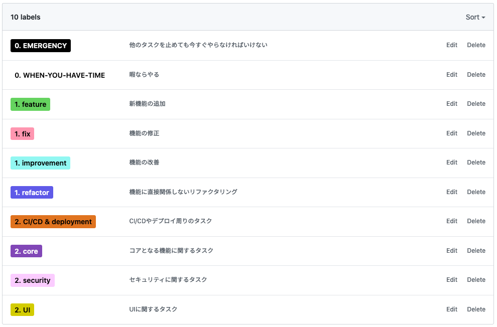

# TSUKUBA-TAKEOUT-PROJECT

## ディレクトリ構成
※ 初めて開発する場合は[開発の仕方](#開発の仕方)を読んでください。

```
.
├── README.md ------------------- 今読んでるもの
├── api, food_tickets, 
        tsukuba_takeout, users -- Djangoアプリ
├── assets ---------------------- CSS/JS生成物
├── manage.py ------------------- Djangoマネージャ
├── pyproject.toml -------------- Poetryファイル
├── static ---------------------- 静的ファイル配信ディレクトリ
├── styles ---------------------- スタイル定義ディレクトリ
└── typescript ------------------ スクリプト定義ディレクトリ
```

### `api` など - Djangoアプリ

Djangoのアプリケーションです。Djangoプロジェクトはtsukuba_takeoutディレクトリです。

中身はベーシックなDjangoアプリケーションなので説明は省略します。Djangoについては公式ドキュメントを参照してください。

### `assets` - CSS/JS生成物

**このディレクトリ配下のファイルは基本的に人の手で編集しません。**

後述する `styles` や `typescript` ディレクトリに書いたファイルが変換されてこの `assets` ディレクトリに格納されます。


### `manage.py` - Djangoマネージャ

Djangoのマネージャスクリプトです。 `./manage.py <command>` とコマンドを実行することでDjangoプロジェクトの操作が可能です。

詳しくは `./manage.py --help` コマンドを参照してください。

### `pyproject.toml` - Poetryファイル

このプロジェクト[開発の仕方](#開発の仕方)にもある通り Poetry を使っています。

このファイルはPoetryの設定ファイルです。依存しているPythonモジュールやPythonのバージョン設定などがしてあります。

### `static` - 静的ファイル配信ディレクトリ

**このディレクトリ配下のファイルは基本的に人の手で編集しません。**

Djangoアプリケーションをサーバにデプロイする際、静的ファイルを一つのディレクトリにまとめる必要がありますが、それ用のディレクトリです。

`./manage.py collectstatic` コマンドで `static` ディレクトリに静的ファイルを集めることができます。

### `styles` - スタイル定義ディレクトリ

この中にスタイルを定義していきます。 **`styles/<app-name>/css/<style-name>.scss` を満たすように名前を付けると良いです。**

このように名前を付けた場合、Djangoテンプレートファイル内では `` としてスタイルを取得できます。

`./manage.py collectstatic` コマンドを実行した場合、 `static/<app-name>/css/<style-name>.css` に書き出されます。

### `typescript` - スクリプト定義ディレクトリ

この中にブラウザ上で走らせるスクリプトを定義していきます。 `ts` ファイルか `tsx` ファイルが利用可能です。 **`typescript/<app-name>/js/<script-name>.(ts|tsx)` を満たすように名前を付けると良いです。**

このように名前を付けた場合、Djangoテンプレートファイル内では `` としてスクリプトを取得できます。

**なお、 `_` 以外の文字で始まるファイル名のファイルがトランスパイルのエントリーファイルです。** `_` で始まるファイル名のファイルはインポート専用のファイルとして利用され、直接はトランスパイルされません。 `_` で始まるファイル名のファイルは `_` 以外で始まるファイル名のファイルから読み込んで利用する形になります。

`./manage.py collectstatic` コマンドを実行した場合、 `static/<app-name>/js/<script-name>.js` に書き出されます。


## 開発の仕方

### 開発環境

Pythonの環境には[poetry](https://python-poetry.org/)を使っています。

仮想環境は `.venv` 配下にあります。


### 開発を始める前に

プロジェクトルートディレクトリで下記コマンドを実行して依存ライブラリをインストールしてください。

```sh
$ poetry install
```

poetryの機能により、python仮想環境のシェルを立ち上げます。

```sh
$ poetry shell
```

今後はこのシェルの中で各コマンドを実行すると良いでしょう。

最初にデータベースの作成とマイグレーションを行います。


```sh
$ python manage.py makemigrations
$ python manage.py migrate
```

これで開発の準備は整います。

### 開発サーバの起動

以下のコマンドで開発サーバが起動します。

```sh
$ python manage.py runserver
```

その他のコマンド類に関してはdjangoのドキュメントを参考にしてください。


## Issue管理

このプロジェクトではIssueタスクチケットとして管理しています。

### Issueの作り方

issueにはテンプレートが用意されています。テンプレートに従って入力してください。

このプロジェクトのissueには、以下のようなラベルが用意されています。



接頭辞の数字順にラベルを付けると自然に分類される仕組みです。0は必要なときのみ付けてください。

issueを発行した際は、Projectに `PROJECT-KANBAN` を設定してください。設定することにより、[GitHub Projects](https://github.com/sudame/tsukuba-takeout/projects/1)で自動的にタスクが管理されます。
